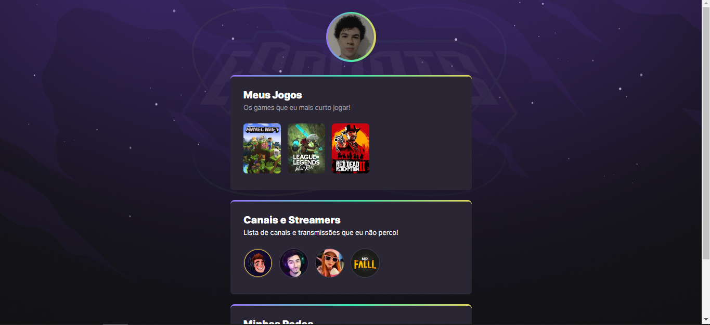

# NLW eSports - Trilha Explorer

Projeto construído no evento Next Level Week da Rocketseat. design responsivo utilizado conceitos avançados de CSS, como grid, flexbox e animations.

[Clique aqui para acessar](https://edu-almeidaf.github.io/nlw-esports-explorer/)

---

## Tecnologias Utilizadas:

- HTML
- CSS
- Git e Github

---

## Contato

[Linkedin](https://www.linkedin.com/in/almeidaedu/)